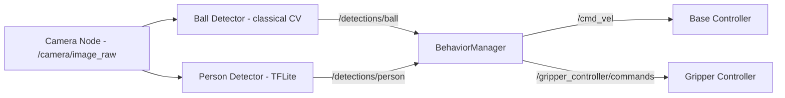
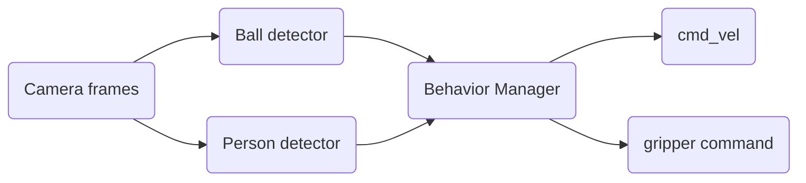
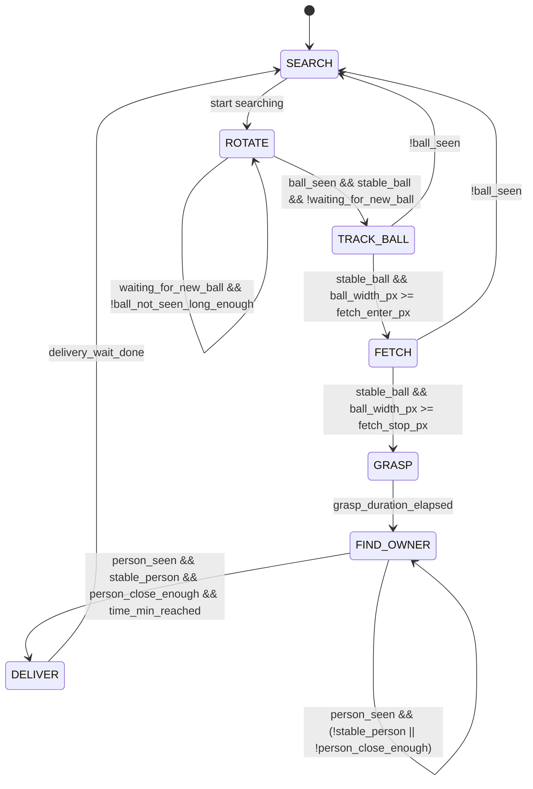

# mecanumbot_camera

ROS 2 camera, detection, and behavior-control stack for a mecanum-drive robot that targets Raspberry Pi hardware. It streams video, detects balls and people, fuses the views into a debug overlay, and drives an autonomous FSM to fetch and deliver the ball.

## Features

- Raspberry Pi camera streaming via `video_publisher` -> `/camera/image_raw`
- HSV ball detection (`ball_tracker_rgb`) publishing `/detections/ball` plus mask/debug images
- TensorFlow Lite SSD person detection (`people_detector`) publishing `/detections/person`
- `overlay_fused` draws both detections over the camera feed on `/camera/fused_debug`
- `behavior_manager` runs the complete fetch/deliver FSM (search -> track -> fetch -> grasp -> find owner -> deliver -> wait)
- Designed for live visualization in RViz/Foxglove using the debug topics, especially `/camera/fused_debug`.
- Sample Pi camera recordings live in `media/`; use them to exercise the nodes when real hardware is not attached (e.g., publish them via `ros2 bag play` or a custom script).
- One command launches the full stack:

```bash
ros2 launch mecanumbot_camera camera_and_detectors.launch.py
```

> Legacy ONNX models in `models/` are not used anymore. The people detector downloads a TFLite model at runtime.

---

## 1. Hardware & Software Requirements

### 1.1 Supported hardware

**Raspberry Pi 5**
- Raspberry Pi OS (64-bit) with ROS 2 built from source
- `vision_msgs` and `vision_opencv` also built from source
- Uses the PiCamReader (libcamera) backend; no `/dev/video*` node is needed

**Raspberry Pi 3**
- Ubuntu 22.04 with the official ROS 2 binaries
- `vision_msgs` and `vision_opencv` installed from apt
- Default image lacks native libcamera support; connect a USB camera via v4l2 or add a PiCam wrapper node

### 1.2 ROS 2 requirements

Any full ROS 2 distribution (Humble tested) as long as the following packages are installed:

```bash
sudo apt install \
  ros-<ros2_distro>-cv-bridge \
  ros-<ros2_distro>-vision-msgs \
  ros-<ros2_distro>-vision-opencv
```

### 1.3 Python requirements

| Component       | Required version      | Notes                                                                                     |
|-----------------|-----------------------|-------------------------------------------------------------------------------------------|
| Python          | 3.11.x                | Tested on Raspberry Pi OS. Python 3.12 is not recommended yet.                            |
| NumPy           | >=1.23 and <2.0       | NumPy 2.x breaks TFLite + OpenCV + rclpy ABI. Recommended pin: `numpy==1.26.4`.           |
| OpenCV          | 4.7.x recommended     | Newer builds sometimes break TFLite + `cv_bridge` ABI on ARM hardware.                    |
| tflite-runtime  | Matching Python ABI   | Required by `people_detector`. Use prebuilt wheels rather than `onnxruntime` on the Pi.   |

**Installing TensorFlow Lite runtime**

Pi 5 (aarch64):

```bash
pip install https://github.com/google-coral/pycoral/releases/download/release-frogfish/tflite_runtime-2.14.0-cp311-cp311-linux_aarch64.whl
```

Pi 3 (armv7l):

```bash
pip install tflite-runtime
```

### 1.4 Camera requirements

- Pi 5 builds rely on `PiCamReader` using libcamera; no `/dev/video0` is necessary.
- Pi 3 on Ubuntu 22.04 does not ship libcamera PiCam support, so either:
  - Use a USB camera exposed as a v4l2 device, or
  - Provide a custom PiCam wrapper node (not included in this repository).

---

## 2. Project Structure

```text
mecanumbot_camera/
|-- config/
|   \-- params.yaml                    # All configurable parameters
|-- launch/
|   \-- camera_and_detectors.launch.py
|-- mecanumbot_camera/
|   |-- video_publisher.py
|   |-- ball_tracker_rgb.py
|   |-- people_detector.py
|   |-- overlay_fused.py
|   \-- behavior_manager.py
|-- models/                            # Legacy ONNX artifacts (unused)
\-- media/, resource/, etc.
```

---

## 3. Node Architecture

### ROS2 Node Architecture Diagram (Node Graph)


### Active nodes (from `camera_and_detectors.launch.py`)

- `/video_publisher`
- `/ball_tracker_rgb`
- `/people_detector`
- `/overlay_fused`
- `/behavior_manager`

### Topic Flow Diagram (Data Pipeline)


### Topic graph

```text
video_publisher
  -> /camera/image_raw        (sensor_msgs/Image)

ball_tracker_rgb
  -> /camera/image_mask       (sensor_msgs/Image)  HSV mask
  -> /camera/image_debug      (sensor_msgs/Image)  debug visualization
  -> /detections/ball         (vision_msgs/Detection2DArray)

people_detector
  -> /camera/people_debug     (sensor_msgs/Image)
  -> /detections/person       (vision_msgs/Detection2DArray)

overlay_fused
  -> /camera/fused_debug      (sensor_msgs/Image)
  <- /camera/image_raw
  <- /detections/ball
  <- /detections/person

behavior_manager
  <- /detections/ball
  <- /detections/person
  -> /cmd_vel                      (geometry_msgs/Twist)
  -> /gripper_controller/commands  (std_msgs/Float64)

Standard ROS infrastructure topics (`/tf`, `/tf_static`, `/rosout`, `/parameter_events`,
`/clicked_point`, `/initialpose`, `/goal_pose`) are present when running inside a full ROS system.
```

---

## 4. Node Descriptions

### 4.1 `video_publisher`

Streams 640x480@30 FPS frames from the Raspberry Pi CSI camera through `PiCamReader`, applies a hue shift for color correction, and publishes `/camera/image_raw`. Camera info is not published by default; add another publisher if your stack requires it.

> **Tip:** If you already have a camera driver elsewhere in your robot stack (e.g., the mecanumbot base publishes `/camera/image_raw`), you can omit this node entirely and remap `ball_tracker_rgb`, `people_detector`, and `overlay_fused` to subscribe to that existing topic. The rest of the system does not depend on this specific publisher.

### 4.2 `ball_tracker_rgb`

HSV-based color segmentation to detect the tracked ball.

- **Key parameters:** `image_topic`, `mask_image_topic`, `debug_image_topic`, `det_ball_topic`,
  `hsv_lower`, `hsv_upper`, `median_ksize`, `morph_kernel`, `morph_iters`,
  `min_area_px`, `min_circularity`, `use_enclosing_circle`.
- **Outputs:** `/detections/ball`, `/camera/image_mask`, `/camera/image_debug`.

### 4.3 `people_detector`

Runs a TensorFlow Lite SSD model. If the model is missing, it is downloaded and extracted automatically at startup.

- **Key parameters:** `image_topic`, `det_topic`, `conf_threshold`, `infer_every_n` (throttles inference for higher FPS on Pis).
- **Outputs:** `/detections/person`, `/camera/people_debug`.
- **Note:** Uses `tflite-runtime` exclusively; ONNX or `onnxruntime` are not required.

### 4.4 `overlay_fused`

Fuses `/camera/image_raw`, `/detections/ball`, and `/detections/person` into `/camera/fused_debug` for visualization. The node’s internal default subscribes to `/camera/people_debug`; the provided `params.yaml` switches it to `/camera/image_raw`.

### 4.5 `behavior_manager`

Finite state machine that controls robot locomotion and gripper behavior.

- **Inputs:** `/detections/ball`, `/detections/person`.
- **Outputs:** `/cmd_vel`, `/gripper_controller/commands`.
- **States:** `SEARCH`, `TRACK_BALL`, `FETCH`, `GRASP`, `FIND_OWNER`, `DELIVER`, and idle/waiting transitions.
- **Important parameters:** `image_width=640`, `fetch_enter_px=200`, `fetch_stop_px=280`,
  `REQUIRED_BALL_STABLE=3`, `REQUIRED_PERSON_STABLE=3`, `ball_lost_timeout=1.0`,
  `person_lost_timeout=1.0`, `new_ball_absent_time=2.0`, `Kp_rot=0.0025`, `Kp_fwd=0.015`,
  `max_ang=0.8`, `max_lin=0.30`.

### ⚙️ Behavior Manager – State Machine

The robot’s behavior is controlled by a six-state finite state machine (FSM):
SEARCH → TRACK_BALL → FETCH → GRASP → FIND_OWNER → DELIVER

The states and transitions can be followed below:



---

## 5. Configuration (`config/params.yaml`)

`camera_and_detectors.launch.py` loads `config/params.yaml` using `PathJoinSubstitution`.
Currently the YAML file provides:

- `ball_tracker_rgb`: HSV lower/upper bounds, minimum area, and topic names.
- `people_detector`: image topic, debug topic, detection topic, TFLite path, and inference settings.
- `overlay_fused`: input topics and fused output topic.

Additional `ball_tracker_rgb` knobs (median blur, morphology, circularity, etc.) are declared in the node itself and can be changed via `ros2 param set` or by editing the defaults in `ball_tracker_rgb.py`. `behavior_manager` parameters are hard-coded inside `behavior_manager.py`; exposing them via YAML would require code changes.

---

## 6. Building & Running

### 6.1 Clone

```bash
mkdir -p ~/ros2_ws/src
cd ~/ros2_ws/src
git clone https://github.com/Fortuz/mecanumbot_camera.git
cd ..
```

### 6.2 Install dependencies (Ubuntu 22.04 / Pi 3)

```bash
sudo apt update
sudo apt install \
  ros-<ros2_distro>-vision-msgs \
  ros-<ros2_distro>-vision-opencv \
  python3-pip
```

### 6.3 Force NumPy < 2.0

```bash
pip install --upgrade "numpy<2.0"
```

### 6.4 Build

```bash
cd ~/ros2_ws
colcon build --packages-select mecanumbot_camera
source install/setup.bash
```

### 6.5 Run

```bash
ros2 launch mecanumbot_camera camera_and_detectors.launch.py
```

### 6.6 Inspect

```bash
ros2 node list
ros2 topic list
```

---

## 7. Debugging & Visualization

- Debug topics: `/camera/image_mask`, `/camera/image_debug`, `/camera/people_debug`, `/camera/fused_debug`.
- View streams directly in RViz (add `Image` displays for the topics) or via:

```bash
ros2 run rqt_image_view rqt_image_view
```

Foxglove Studio is another convenient option for remote visualization.

---

## 8. Performance Tuning (Pi 3 / Pi 5)

- Increase `infer_every_n` to skip frames in `people_detector` for higher FPS.
- Increase `conf_threshold` for more stable person detections in noisy scenes.
- Reduce `median_ksize`, `morph_kernel`, and `morph_iters` in `ball_tracker_rgb` to reduce CPU load.
- Lower Pi camera resolution or FPS in `PiCamReader` if resources are constrained.

---

## 9. Docker Support

A refreshed Dockerfile (`osrf/ros:humble-ros-base`) builds the package with NumPy 1.26, OpenCV 4.9, and `tflite-runtime`. The compose file is tailored for Windows hosts (Linux containers) with RViz forwarding over X11.

**Usage**

1. Start an X server on Windows (VcXsrv/x410) and set `DISPLAY=host.docker.internal:0.0`.
2. Build the image: `docker compose build`.
3. Launch the dev container: `docker compose up -d`.
4. Open a shell inside: `docker compose exec mecanumbot_camera bash`.
5. Inside the container:
   ```bash
   source /opt/ros/humble/setup.bash
   colcon build --event-handlers console_direct+
   source install/setup.bash
   ros2 launch mecanumbot_camera camera_and_detectors.launch.py
   ```

The compose file bind-mounts your workspace to `/ws/src/mecanumbot_camera` and keeps `build/`, `install/`, and `log/` in Docker named volumes so rebuilds survive container restarts.

---

## 10. License

```
Copyright 2025 mecanumbot_camera contributors

Licensed under the Apache License, Version 2.0 (the "License");
you may not use this file except in compliance with the License.
You may obtain a copy of the License at

    http://www.apache.org/licenses/LICENSE-2.0

Unless required by applicable law or agreed to in writing, software
distributed under the License is distributed on an "AS IS" BASIS,
WITHOUT WARRANTIES OR CONDITIONS OF ANY KIND, either express or implied.
See the License for the specific language governing permissions and
limitations under the License.
```
